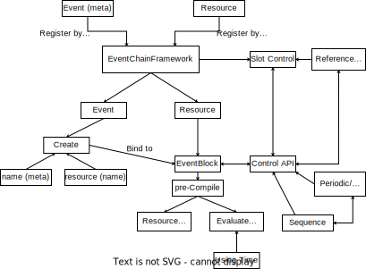
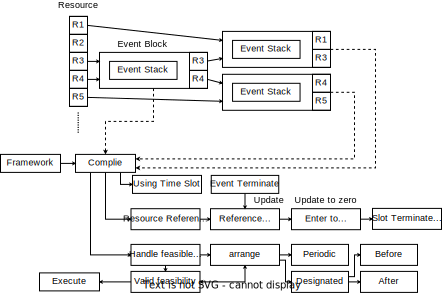
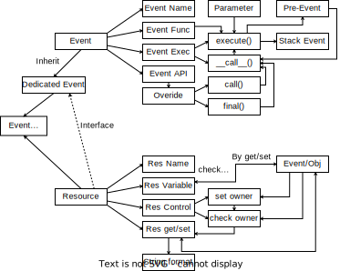

# Event-Chain Framework Public Version

The Event framework design for interaction of multiple parallel object.

## Introduction of Framework

The basic concept is *Event-driven* and *Resource-hosting*.
1. Every process in the framework should be registered to event.
2. Every event can only use the resource hosted by framework.
3. Every changing of environment should be triggered by event.
4. The framework API is the agent for interacting with external environment.

The framework has a natural capability of multi-threading.
- The processing of every event can be isolate.
- The atomicity for a sequence of events can be promise by the technology called *event stack*.
- The resource using of an event-block is perspective for every event-block.
- Every resource must be bound by an event or object to the owner.
- The resource owner can get the resource object, while other caller only can obtain the string format description of a resource.
- The foreknowledge provide by lazy processing technology.

## Event-Chain Framework

The architecture of Event-Chain Framework is shown in following picture.



### Declare Event and Resource

The framework handle a dictionary to maintain the resource and thread process.

If any resource and event want to run in the environment maintained by the framework, they should be registered in the framework first.

```python
env = EventChainFramework('env')
f1 = lambda x,y : print(x(True)+y(True))
event = env.register_event('event plus',f1)
x1 = env.register_res('x1',1)
x2 = env.register_res('x2',2)
```
Wherein, `'x1'`, `'x2'` is resource name, and `'event plus'` is event name.

This is a lazy process, we register the function to a type of event, then we create event by the event type name, such as
```python
instance = env.create_event(event,'event x1 + x2',x1,x2)
```

We can stack the multiple events due to the *Event Block* process.

### Event Block



The stack of event called event-chain, it can not be interrupted and they may require the different resource.

The elaborate event in framework can record the resource requirements, and we can package these event to a Event Block by
```python
pkg = env.package('block x1+x2',instance)
```
It will call a compile function and expose its using resource for advance process.

### Process a Sequence

We can establish multiple event block for different instance of event stack.

Then, we use `sequence()` to dicide the processing sequence of every event block.
```python
env.sequence(pkg1,pkg2,pkg3,...)
```

Worth to note that, the every event block in sequence should have been compiled.

Consequently, the framework can call following function to execute the process.
```python
env.run(start=0,until=3)
```
The event block in sequence will be processed with 3 iteration `(0 <= t < 3)`.

### Design Event for Framework Resource

Because of the `handler()` of `Resource` API is used, we should use the incoming arguments like
```python
f1 = lambda x,y : print(x(True)+y(True))
def foo (var1,var2,var3) :
    # obtain real value
    true_var1 = var1(True)
    true_var2 = var2(True)
    true_var3 = var3(True)
    # set value back to resource
    var1(value=true_var1)
    var2(value=true_var2)
    var3(value=true_var3)
```

#### Time limit and Periodic

The Event Block can set the lantency limit and periodic function for framework compiling the sequence.

This setting should be set at the Event Block constructing like
```python
env.package('Event Block Name',event_stack,latency=None,periodic=lambda x : x==2)
```

The `latency` will be inspect at compile process.

If is current block-chain sub-slot using excess this limit, the running process will be terminated by assert.

This means the sequence of the process need to be modify.

The `periodic` should be a function requires a single argument (time slot), and it should return the boolean result when the Event Block need to be process.

#### Other Terminate Condiction

We can set running range by arguments of `start` and `until` in `run()`.
```python
env.run(start=0,until=4)
```
Instead, we can use any function like `func(time_slot) -> bool` to be a terminated function for controling the ending time.

#### Dynamin Event

Original framework sequence is a staic periodic EventBlock-Chain, link a basic operating model.

When we need to dynamic the decided events in current event, we can using `dynamic_event()` to generate event.
```python
env.dynamic_event(event_chain)
```
The `event_chain` cna be an arbitrary Event or EventBlock, and it will be append to a sub-sequence to be an advance phase process.

These phase process will be regarded as conventional Event sequence to process, but it is not periodic process.

The sub-process can be generated iterative in every phase.

A slot will be terminated when all periodic process and sub-process is terminated, if and only if.

#### Multi Thread

Although the Framework is designed for Multi-thread process, in the small scale environment may have lower perfomance.

Considering this scene, we can tune the configuration of Multi-thread process by
```python
env.use_threading(choose)
```
Choosing `True` to open Multi-thread either is single thread.

The default setting of framework is using the Multi-thread process.

### Detail of API

```python
# In Event Block
description(text=None)
reset()
is_run()
recompile()
name()
periodic(*args)
is_late(t)
append_event(event)
compile(start=0)
is_compile()
show_time()
apply_res(event_block, res_index)
trace_res(res_index)
pass_res(res, pass_and_run=False)
__call__(start=0,test=False) # need to append test feture
# In framework
register_event(event_type_name,event_func,descri=None)
set_event_descri(event_name,text)
register_res(res_name, var)
create_event(event_type_name,event_name,*argv)
package(process_name,event_chain,latency=None,periodic=lambda *x : True)
sequence(*blocks)
show_sequence()
show_res()
show_event()
compile_slot(t=0,show=False)
dynamic_event(event_chain)
run_slot(slot,sub_seq=False)
run(start=0,until=1)
is_run()
wait_to_finish()
use_threading(choose=True)
logtime()
```

## Event Object and Resource Object

The properties which benefit to process the multithreading are provided by the event object and resource object themself.

The following figure illustrates a relation of these components.



### Event Object

An event is declared by **event name**, **event function** and **function arguments**, such as
```python
foo = lambda x,y : x+y
fooEvent = Event('foo x=1, y=2',foo,1,2)
```
Note that, the arguments of the function executing in the `Event` must be decided at the beginning.

Then, we can execute this event by
```python
r = fooEvent()
```
The results returned by function will be packaged to a tuple with the next event.

Moreover, the specific processing will be not using external variables.

Besides, we can contruct a atomicity sequence of events by following procedure.
```python
foo1 = lambda x,y : x*y
foo1Event = Event('foo1 x=1, y=2',foo1,1,2)
fooEventChain = fooEvent(foo1Event)
```
Here, `fooEventChain` is an event-chain, which is constructed by `foo1Event` and `fooEvent`.

Actually, this operation will return an event which is an argument, and set the next event for inside one to the outside one.

Thus, we can execute the event-chain with two operation
```python
r1 = fooEventChain()
r2 = fooEventChain.execute()
```
As the `fooEventChain == foo1Event`, the operation of `fooEventChain()` will will only execute the function of `foo1Event`, and return the tuple of a result and an object of the next event.

On the other hand, `fooEventChain.execute()` will execute the sequence of `[foo1Event, fooEvent]`, and return the list consisting of the result and spent time of each `Event` object.

The cost of time for each `Event` can be set by
```python
time_cost = 1
fooEvent.detail(time_cost=time_cost)
```
As the event-chain is a lazy process, we can only evaluate event time by 
```python
whole_time_cost = fooEventChain.execute(start=1,test=True)
```
Then, we can obtain the ending time for the stack of the entire event stack form `start=1` to the end.

The atomicity of a event-chain is guaranteed by the properties include
- The atomicity of each event by pre-allocate argument.
- The each event can only have a next event.
- The chaging of sub-event-chain will not impact other sub-event-chain.

Thus, the event-chain can be used to establish a protocol or other process require a sequence of the uninterrupted events.

#### Design your event

The class `Event` provide 2 interface to customize Event for dedicated process.

|Method|Return|Feature|
|:----:|:----:|:-----|
|`call()`| list/tuple| called before event function, and provide arguments for event function|
|`final()`| boolean| called after event function, and provide a boolean value to terminate the event chain|

The basic definition of these Function is 
```python
def call(self) :
    return self.argv

def final(self) :
    return False

```

The others public API is defined by

|Method|Return|Feature|
|:----|:----:|:-----|
|`detail(time_cost=False)`|None|set the detail of event, currently only provide time_cost of event|
|`execute(var_iter=None,start=0,test=False)`|list|execute the event chain, and can set the external variable, start time, and test flag|
|`name()`|str|get the name of event|
|`is_single()`|boolean|if the event do not have next event, return `True`|
|`top()`|Event obj|get the final event in the event stack|
|`next_event()`|Event obj|get the next event of a event|

#### The iterative event

Through the interface of `call()`, `final()` and iterative variable, the iterative event can be achieved.

Inherit and overide the interface of them, such as
```python
class iterEvent(Event) :
    def call(self) :
        if self.var_iter :
            arg = [self.var_iter,*self.argv]
        else :
            arg = [0,*self.argv]
        return arg

```
As the return of event function will be captured and set to external variable of next event, we can use external variable for achieving the iteration of stack.

```python
a = lambda x,y : x+y
b = 2
c = 1
e1 = Event('Simple Add 1',a,b,c)
e2 = iterEvent('Simple Add 2',a,b)(e1)
e2.execute()
```

### Resource Object

A Resource is defined by **Resource anme** and a **Variable**.

In here, we suggest to declare variable when create the **Resource**, such as
```python
res = Resource('res',1)
```
This suggestion can ensure the resource is protected by Resource object, and it cannot be modify by other object.

If we want to modify the value and obtain the full permission of this resource, we should bind the object to the resource.
```python
e = Event('event',lambda:print(x),res)
res(e)
```
then, we can use `res.get(e)` and `res.set(e,var)` to modify the resource.

Other object can not modify the resoucre, but the value of resource still can be obtained by `res.get()`.

The other API of resource object is listing as following.

|Method|Return|Feature|
|:----|:----:|:-----|
|`using()`|object|return the binding object/value of this resource|
|`name()`|str|get the name of resource|
|`handler(caller)`|function|return the function which can process get and set for designated caller|

The `handler()` is useful to operate the resource without multiple key in the object, such like
```python
fun = res.handler(e)
fun(True) # Equivalent to res.get(e)
fun(value=var) # Equivalent to res.set(e,var)
```

